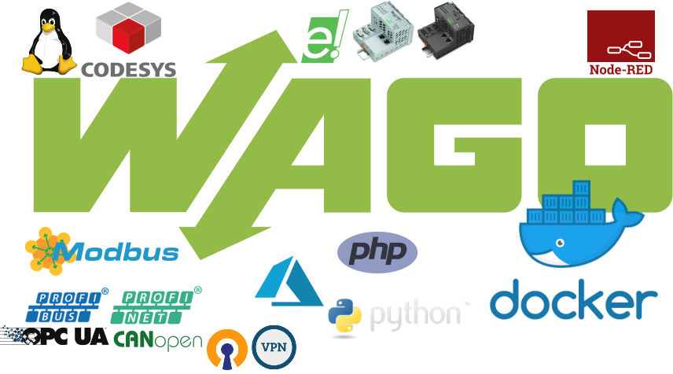

# WAGO PLC Tutorials

## Web Based Management

1. [How to customize WBM add Items to configure](./tutorials/WBM/How%20to%20customize%20WBM%20add%20Items%20to%20configure "How to customize WBM add Items to configure")

## Applications

1. [How to install Docker CE](./tutorials/APP/How%20to%20install%20Docker "How to install Docker CE")  
2. [How to install Mosquitto Broker](./tutorials/APP/How%20to%20install%20Mosquitto%20Broker "How to install Mosquitto Broker")  
3. [How to install Node.js](./tutorials/APP/How%20to%20install%20Node.js "How to install Node.js")  

## System

1. [Security - Firewall](./tutorials/SYSTEM/Security%20Firewall "Security - Firewall")

## List of IPK (WAGO)

| Name               | Descriptions                                                     | Download          |
| ------------------ | ---------------------------------------------------------------- | ----------------- |
| Docker             | Docker is an open platform for developing, shipping, and running applications in packages called containers. | [docker_19.03.08_armhf.ipk](https://docs.google.com/uc?export=download&id=1y0Pi5meVQA0jX3owrw0kNYk1PuCR3q74)      |
| Docker-Compose  | Docker Compose is a tool for defining and running multi-container Docker applications. With Compose, you use a YAML file to configure your application’s services.  | [docker_compose_1.21.1_armhf.ipk](https://docs.google.com/uc?export=download&id=1rrVQ4NJSf8vOD1B5JQ3gOkNQKwmbxiLZ)      |
| KBus ModBus Slave  | Kbus Modbus Slave application. | [kbusmodbusslave_1.3.0_arm.ipk](https://docs.google.com/uc?export=download&id=1N1qr7Hr_VJJOvTT4qPIE_7pFCGxuXcI2)      |
| libcoap  | libcoap is a C implementation of a lightweight application-protocol for embedded devices using Constrained Application Protocol (CoAP) | [libcoap_4.1.1_arm.ipk](https://docs.google.com/uc?export=download&id=1Ep9XqpbWBP5xgF9ARs9BCFJh-zDi8tee)     |
| libcurl  | libcurl is a free and easy-to-use client-side URL transfer library, supporting DICT, FILE, FTP, FTPS, Gopher, HTTP, HTTPS, IMAP, IMAPS, LDAP, LDAPS, POP3,POP3S, RTMP, RTSP, SCP, SFTP, SMTP, SMTPS, Telnet and TFTP. libcurl supports SSL certificates, HTTP POST, HTTP PUT, FTP uploading, HTTP form based upload, proxies, cookies, user+password authentication (Basic, Digest, NTLM, Negotiate, Kerberos), file transfer resume, http proxy tunneling and more! | [libcurl_7.26.0_arm.ipk](https://docs.google.com/uc?export=download&id=1DP-or7PMTHudGmPO7xNc_103JXanlZGA)        |
| libwebsockets  | Libwebsockets (LWS) is a flexible, lightweight pure C library for implementing modern network protocols easily with a tiny footprint, using a nonblocking event loop. | [libwebsockets_v1.7.3_arm.ipk](https://docs.google.com/uc?export=download&id=1CaiOpBAlEy-9tQ1YcVxOeh8eyOLmzvxt) |
| Mono     | mono is a runtime implementation of the ECMA Common Language Infrastructure. It can be used to run ECMA and .NET applications. | [mono_4.6.2.7_arm.ipk](https://docs.google.com/uc?export=download&id=1xUpo2hDsctI-XVV5EV5mEt3Cs_jhjNEi)           |
| Mosquitto         | Mosquitto MQTT Broker. | [mosquittoBroker_1.4.14_armhf.ipk](https://docs.google.com/uc?export=download&id=1N0Vi6Cby9fBXcM55gbeDdRTUBh2td3Me)                            |
| Node.js         | Node.js is an open-source, cross-platform, JavaScript runtime environment that executes JavaScript code outside of a web browser. | [nodejs_0.12.18_arm.ipk](https://docs.google.com/uc?export=download&id=1N1WdskihTNJz7rl5fu0vZfUZZXSrK_1s)                                   |
| Node-RED         | Node-RED is a flow-based development tool for visual programming developed originally by IBM for wiring together hardware devices, APIs and online services as part of the Internet of Things. Node-RED provides a web browser-based flow editor, which can be used to create JavaScript functions. | [node-red_0.15.3_arm.ipk](https://docs.google.com/uc?export=download&id=1BMupibPh7ywC9J2jHb27mGtOAG1hL9Qr)                               |
| liboms       | liboms Operating-Mode-Switches-Reader. | [omsreader_1.0_armhf.ipk](https://docs.google.com/uc?export=download&id=1DZLzDRUTimI4qYe9gKrChcVvIFIQoJgX)                 |
| OpenDDS    | OpenDDS is an open source C++ implementation of the Object Management Group (OMG) Data Distribution Service (DDS). | [opendds_3.10_arm.ipk](https://docs.google.com/uc?export=download&id=1nGuagFn4kfiF4D4qyzf_2DMjURjLochX)                                      |
| SQLite    | SQLite is a C-language library that implements a small, fast, self-contained, high-reliability, full-featured, SQL database engine. With command-Line-Tool "sqlite3". | [sqlite_3220000_armhf.ipk](https://docs.google.com/uc?export=download&id=1CT_BBib50WrrT6TbXabvKMGdVnsbmnKz)                                     |
| strongSwan      | strongSwan is an OpenSource IPsec implementation. | [strongswan_5.3.5_arm.ipk](https://docs.google.com/uc?export=download&id=1mI9cvl0o-Y5blAEOAdGqrUp60qoWv0qd)    |
| TRDP  | Train Real-time Data Protocol (TRDP) module. | [trdp_1.4.1.0_armhf.ipk](https://docs.google.com/uc?export=download&id=10u2HsfsCIoy_wGQCkw_YL3R7vc9KAvLz)      |

## Support our project

Help us out!

